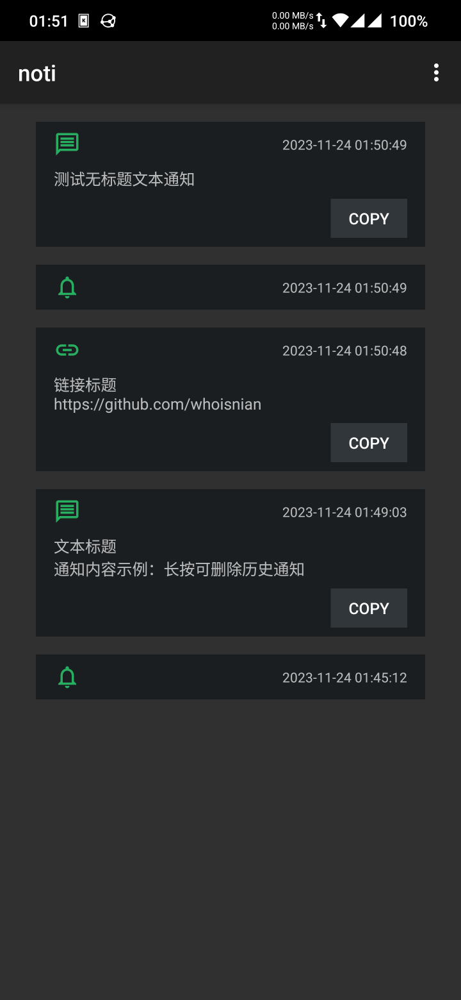
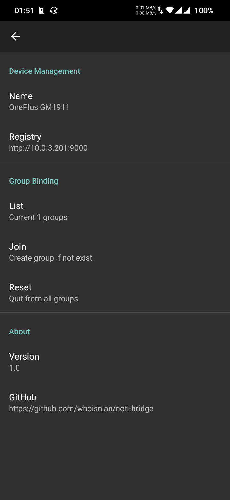

# noti-bridge

## Android preview
 

## FCM configuration
1. Sign up for a [Firebase account](https://console.firebase.google.com)
2. Create a Firebase project in the Firebase console
3. Generate a private key in [Service Accounts](https://console.firebase.google.com/project/_/settings/serviceaccounts/adminsdk)
4. Download the key file and run server with `-c myapp-firebase-adminsdk-xxxxx-xxxxxxxxxx.json`
